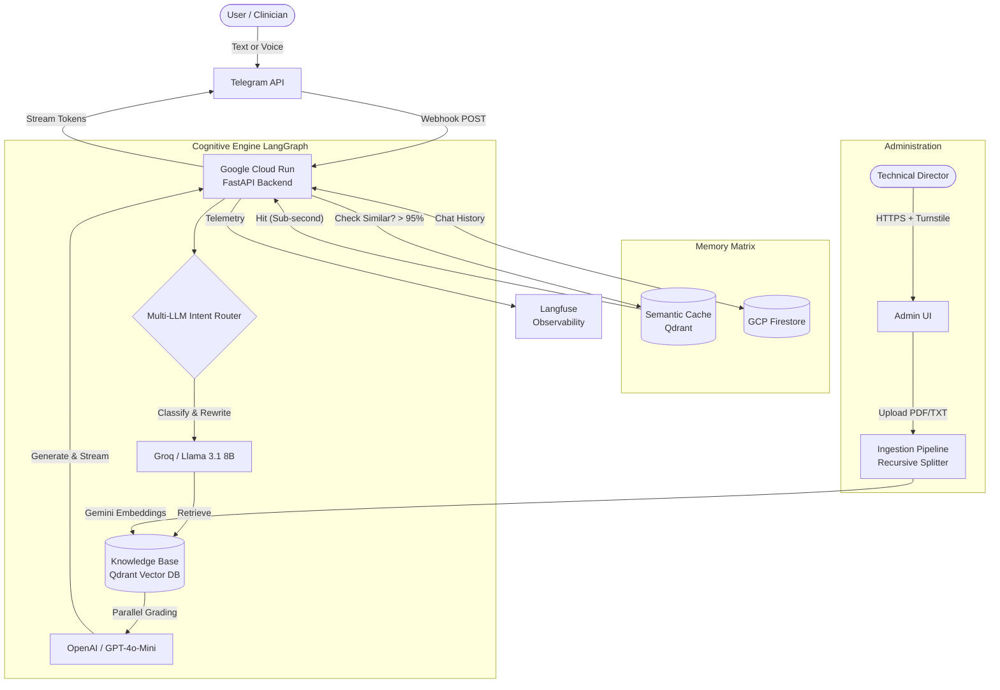

# Visuri RAG Agent - Enterprise Platform
**A Production-Grade Agentic System Architected on Google Cloud Platform**

<p align="center">
  
  
  
  
  
  
  
</p>

## Overview
**Visuri RAG Agent** is an enterprise-grade, serverless Retrieval-Augmented Generation (RAG) ecosystem built to provide high-fidelity, contextual technical support for advanced medical devices.

This platform leverages the **Google Cloud Ecosystem** combined with a **Golden Stack Multi-LLM Architecture** (Groq + OpenAI) to deliver a resilient, cost-effective, and scalable conversational agent. By orchestrating these models via **LangGraph**, the architecture ensures zero-hallucination document grading and real-time streaming for a superior UX.

## Key Features & Professional Architecture
- **Real-Time Async Streaming (UX First):** Fully integrated with Telegram Webhooks using async generators. Delivers a "ChatGPT-like" typing effect with throttled message editing, dropping perceived latency to **~2-3 seconds**. 
- **Multi-Modal Integration:** Handles continuous text context and parses voice messages autonomously using high-concurrency Whisper transcription.
- **Cost-Optimized "Golden Stack" Orchestration:** Powered by **LangGraph**, the system implements a highly specialized Model Routing strategy:
  - **Groq (Llama 3.1):** Handles intent classification and query rewriting at ultra-low latency (~0.2s) using LPU hardware.
  - **OpenAI (GPT-4o-Mini):** Handles parallel document grading and strict instruction-following generation, ensuring high reasoning capability without rate-limit bottlenecks.
- **Native Google Cloud Serverless Infrastructure:** Engineered for **Google Cloud Run**. The stateless architecture enables "Scale to Zero", eliminating idle costs while ensuring instant readiness.
- **Advanced Document Grading:** Before generating a response, the system asynchronously evaluates up to 10 retrieved document chunks (Vector K=10), discarding irrelevant data to mathematically eliminate hallucinations.
- **Full Observability:** Integrated with **Langfuse** for end-to-end tracing. Tracks latency per node, token consumption, and multi-hop reasoning logic in production environments.
- **Secured Administrative Panel:** A professional web interface for knowledge base management. Implements **Cloudflare Turnstile**, **SlowAPI Rate Limiting**, and **Strict HttpOnly Session Management** (OWASP compliance).
- **Prompt Engineering & Reliability:** Advanced system instructions ensure context-adherence, natural human-like conversational tone (occasional engagement questions), and strictly enforces plain-text output (No Markdown) to prevent UI breakage on mobile clients.

## Architectural Topology



## Technology Stack

### Hybrid Resilience Matrix (Multi-LLM Routing)
To ensure Low Latency and High Accuracy, the system implements a proprietary domain-isolated routing logic:

* **Control Plane (Speed):** Groq (Llama 3) — Used exclusively for lightweight, fast tasks like identifying user intent (factual, greeting, out_of_scope) and rewriting queries based on chat history.
* **Reasoning Plane (Fidelity):** OpenAI (GPT-4o-Mini) — Used for parallel document evaluation and generating the final synthesized response adhering strictly to plain-text formatting constraints.

### Cloud & Data Foundations
* **Embedding Model:** Google `gemini-embedding-2-preview` (Hybrid Dense + BM25 Sparse Search)
* **Compute:** Google Cloud Run (Serverless Container Orchestration)
* **Persistent Memory:** Google Cloud Firestore (NoSQL Document Store)
* **Vector Store:** Qdrant Cloud (Managed)
* **CI/CD Ready:** Google Artifact Registry & Cloud Build compatible

### Logic & Orchestration
* **Agentic Framework:** LangGraph (Stateful FSM)
* **Observability:** Langfuse (Execution Tracing & Token Metrics)
* **Web Framework:** FastAPI (Asynchronous Uvicorn)
* **Security:** Cloudflare Turnstile, SlowAPI, NeMo-inspired Input Guardrails.

## Security Posture
* Built-in defenses against OWASP Top 10 vulnerabilities.
* Mitigation of Bruteforce scenarios via bounded Rate Limiting on critical endpoints.
* Cookie issuance encapsulated under Strict `HttpOnly` constraints preventing XSS leakage.
* Input Guardrails validate user messages to prevent prompt injection and ensure medical-grade communication standards before LLM processing.

## Observability & Debugging
The entire RAG pipeline is hooked into Langfuse. This allows:

* **Latent Analysis:** Identifying bottleneck nodes (e.g., measuring Groq classification time vs. OpenAI generation time).
* **Cost Auditing:** Real-time tracking of token consumption across different LLM providers.
* **Streaming Tracing:** Monitoring the exact Time-to-First-Token (TTFT) pushed to the Telegram client.
* **Quality Control:** Auditing retrieved document chunks and the respective "Grade" assigned by the LLM.

## Getting Started

### 1. Prerequisites
Define `.env` using environment variables. Obtain API Keys for:

* `TELEGRAM_BOT_TOKEN`
* `QDRANT_URL` / `QDRANT_API_KEY`
* `OPENAI_API_KEY`
* `GROQ_API_KEY`
* `GOOGLE_API_KEY` (For Embeddings)
* `ADMIN_SECRET_KEY` (Your custom master password)

### 2. Local Environment
```bash
python -m venv .venv
source .venv/bin/activate
pip install -r requirements.txt
uvicorn src.main:app --host 0.0.0.0 --port 8000 --reload
```
Access the admin portal: `http://localhost:8000/admin`

### 3. Deploy to Production (GCP)
```bash
gcloud run deploy rag-agent-v2 \
  --source . \
  --platform managed \
  --region us-central1 \
  --allow-unauthenticated \
  --update-env-vars="OPENAI_API_KEY=your_key,VECTOR_SEARCH_K=10"
```

---
*Built with a passion for scalability, FinOps optimization, and high-performance Agentic AI integration.*

