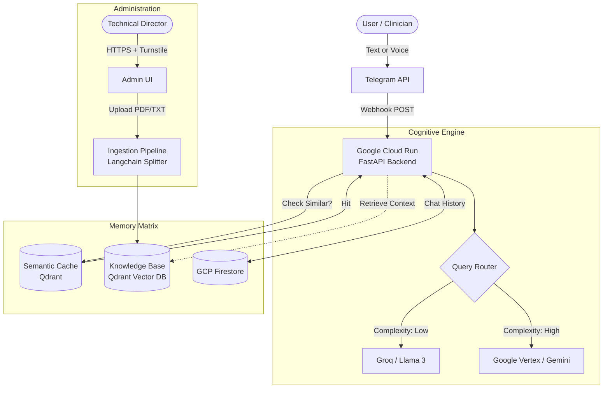

# ReCARE AI FastLearn - Enterprise RAG Platform
**A Production-Grade Agentic System Architected on Google Cloud Platform**

<p align="center">
  
  
  
  
  
</p>

## Overview
**ReCARE AI FastLearn** is an enterprise-grade, serverless Retrieval-Augmented Generation (RAG) ecosystem built to provide high-fidelity, contextual technical support for advanced medical devices (ReCARE / RePAD).

This platform leverages the **Google Cloud Ecosystem** to deliver a resilient, cost-effective, and scalable conversational agent. By orchestrating **Google Gemini 1.5 Pro** and **Google Cloud Run**, the architecture ensures enterprise security and sub-second latency for critical information retrieval.

## Key Features & Professional Architecture
- **Multi-Modal Integration:** Fully integrated with Telegram Webhooks. Handles continuous context and parses voice messages autonomously using high-concurrency transcription models.
- **Native Google Cloud Serverless Infrastructure:** Engineered for **Google Cloud Run**. The stateless architecture enables "Scale to Zero", eliminating idle costs while ensuring instant readiness for user interactions.
- **Intelligent LLM Orchestration:** Powered by **LangGraph**, the system dynamically routes queries between **Gemini 1.5 Pro** for deep technical reasoning and **Llama-3 (via Groq)** for high-speed assistance.
- **Zero-Cost Semantic Caching:** Optimized interception matrix implemented in Qdrant. Semantically similar queries are resolved in 0.05s directly from vector memory, significantly reducing LLM inference costs.
- **Full Observability:** Integrated with **LangSmith** for end-to-end tracing. Tracks latency, token consumption, and multi-hop reasoning logic in production environments.
- **Secured Administrative Panel:** A professional web interface for knowledge base management. Implements **Cloudflare Turnstile**, **SlowAPI Rate Limiting**, and **Strict HttpOnly Session Management** (OWASP compliance).

## Architectural Topology



## Technology Stack
### Google Cloud Foundations
* **Model Reasoning:** Google Gemini 1.5 Pro (Generative AI)
* **Embedding Model:** Google `gemini-embedding-2-preview` (3072 dims)
* **Compute:** Google Cloud Run (Serverless Container Orchestration)
* **Persistent Memory:** Google Cloud Firestore (NoSQL Document Store)
* **CI/CD Ready:** Google Artifact Registry & Cloud Build compatible

### Logic & Orchestration
* **Core Language:** Python 3.12
* **Agentic Framework:** LangGraph & LangChain ecosystem
* **Vector Store:** Qdrant Cloud (Managed)
* **Observability:** LangSmith (Full Execution Tracing)
* **Web Framework:** FastAPI (Asynchronous Uvicorn)
* **Security:** Cloudflare Turnstile, SlowAPI, Hashlib PBKDF2 Sessioning

## Security Posture
- Built-in defenses against **OWASP Top 10** vulnerabilities.
- Mitigation of Bruteforce scenarios via bounded Rate Limiting on critical endpoints.
- Cookie issuance encapsulated under Strict `HttpOnly` constraints preventing XSS leakage.
- Direct payload checks rejecting potentially malicious extensions (enforcing PDF/TXT only, max 15MB chunks) guarding against DoS memory overflow.

## Observability & Debugging
The entire RAG pipeline is hooked into **LangSmith**. This allows:
- **Latent Analysis:** Identifying which nodes (Retrieval vs. Generation) are slowing down the response.
- **Cost Auditing:** Real-time tracking of token consumption across different LLM providers (Groq vs. Gemini).
- **Prompt Versioning:** Fine-tuning and testing new system instructions without blind deployment.
- **Trace Feedback:** Monitoring hallucination flags and document relevance scores.

## Getting Started

### 1. Prerequisites
Define `.env` using environment variables. Obtain API Keys for:
- `TELEGRAM_BOT_TOKEN`
- `QDRANT_URL` / `QDRANT_API_KEY`
- Google API Keys & Groq Keys
- `ADMIN_SECRET_KEY` (Your custom master password)

### 2. Local Environment
```bash
python -m venv .venv
source .venv/bin/activate
pip install -r requirements.txt
uvicorn src.main:app --host 0.0.0.0 --port 8000 --reload
```
Access the admin portal: `http://localhost:8000/admin`

### 3. Deploy to Production (GCP)
```bash
gcloud run deploy rag-agent-v2 \
  --source . \
  --platform managed \
  --region us-central1 \
  --allow-unauthenticated \
  --env-vars-file .env.yaml
```

---
*Built with passion for scalability and high-performance AI integration.*
